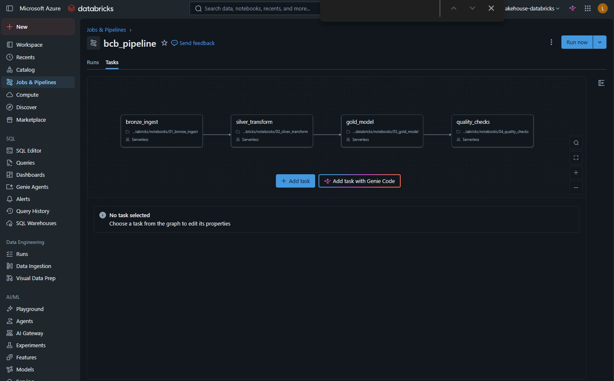
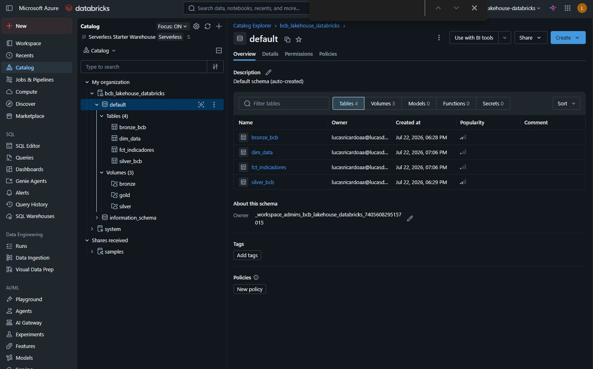
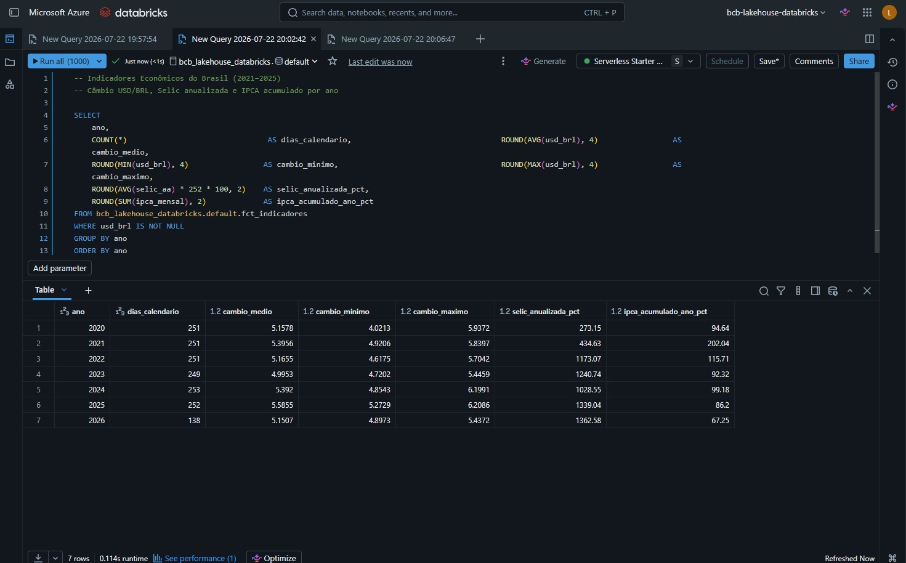
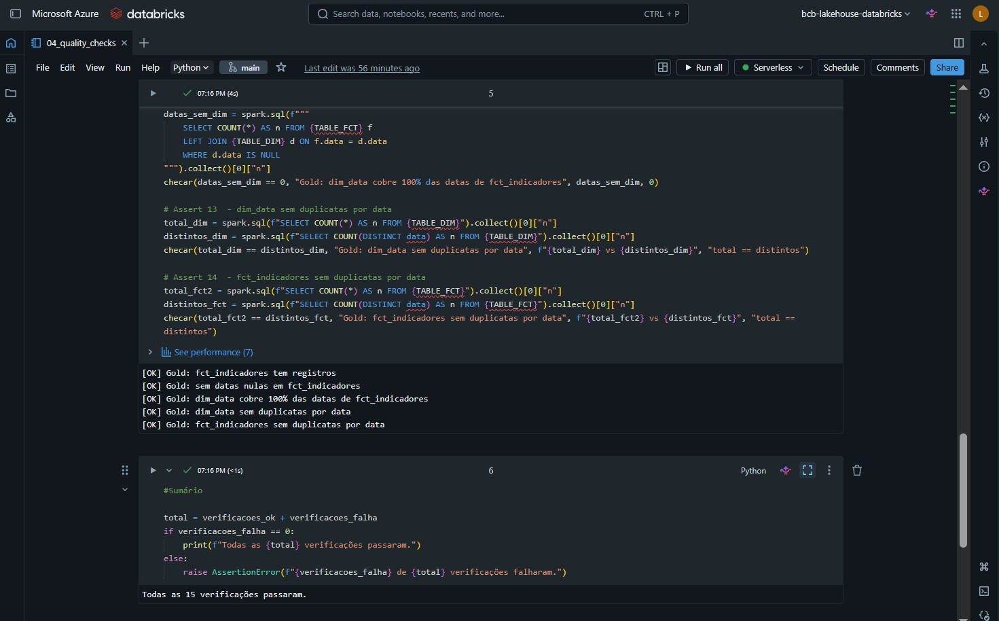
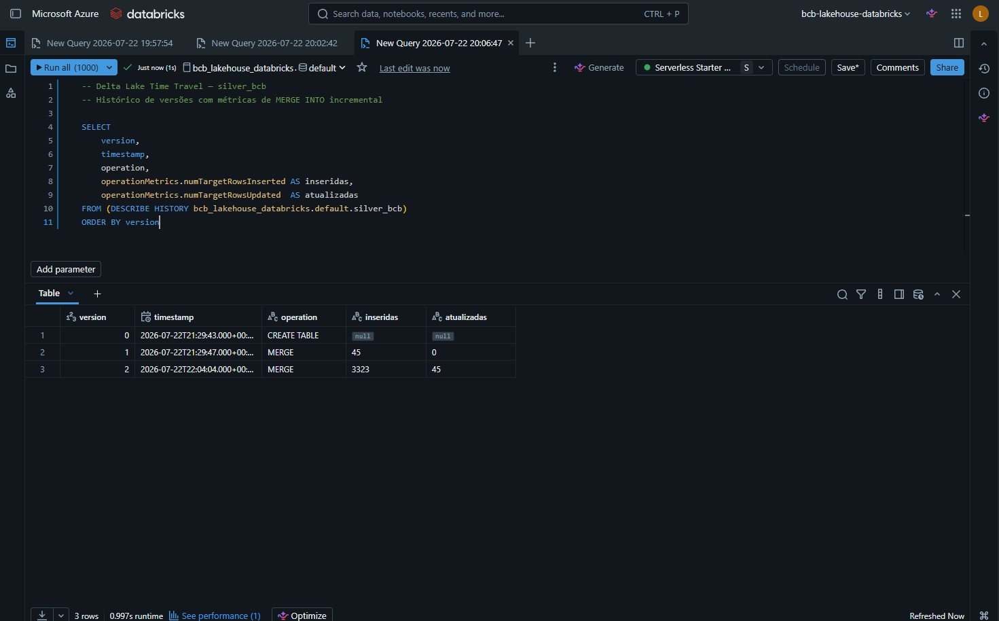

# bcb-lakehouse-databricks

Pipeline de dados medallion no **Azure Databricks** que ingere séries históricas do Banco Central do Brasil (BCB) e constrói um modelo analítico em camadas Bronze → Silver → Gold.

---

## Visão geral

O projeto demonstra a construção de um lakehouse completo sobre **Delta Lake + Unity Catalog**, governado por Architecture Decision Records (ADRs) escritas antes de qualquer linha de código. Os dados cobrem ~6 anos de indicadores econômicos brasileiros (2020–2026).

**Séries ingeridas:**

| Código | Série | Frequência |
|--------|-------|------------|
| 1 | Câmbio USD/BRL | Diária |
| 11 | Taxa Selic | Diária |
| 433 | IPCA | Mensal |

---

## Arquitetura

```
API BCB
   │
   ▼
┌─────────────────────────────────────────────────────────┐
│                  Azure Databricks (Serverless)           │
│                                                         │
│  ┌──────────┐    ┌──────────┐    ┌──────────────────┐  │
│  │  Bronze  │───▶│  Silver  │───▶│       Gold       │  │
│  │          │    │          │    │                  │  │
│  │ Dados    │    │ Cast de  │    │ fct_indicadores  │  │
│  │ brutos   │    │ tipos,   │    │ dim_data         │  │
│  │ (STRING) │    │ limpeza, │    │ (modelo pivot    │  │
│  │          │    │ MERGE    │    │  por data)       │  │
│  └──────────┘    └──────────┘    └──────────────────┘  │
│                                          │              │
│                                          ▼              │
│                                  ┌──────────────┐       │
│                                  │Quality Checks│       │
│                                  │ 15 assertions│       │
│                                  └──────────────┘       │
│                                                         │
│              Unity Catalog — bcb_lakehouse_databricks   │
└─────────────────────────────────────────────────────────┘
         │
         ▼
  Databricks Workflow
  (orquestração das 4 tasks)
```

**Workflow com as 4 tasks encadeadas:**



---

## Stack

| Componente | Tecnologia |
|-----------|-----------|
| Plataforma | Azure Databricks Trial (Serverless, Spark 4.1.0) |
| Storage | Unity Catalog managed tables (ADLS Gen2) |
| Formato | Delta Lake |
| Linguagem | PySpark + SQL |
| Orquestração | Databricks Workflows |
| Versionamento | Git Folder (GitHub) |
| Governança | Architecture Decision Records (ADRs) |

**Catálogo Unity Catalog com as tabelas das 3 camadas:**



---

## Resultados da execução

Pipeline executado com janela histórica `01/01/2020 → 22/07/2026`:

| Camada | Tabela | Registros |
|--------|--------|-----------|
| Bronze | `bronze_bcb` | 3.368 linhas |
| Silver | `silver_bcb` | 3.368 linhas |
| Gold | `fct_indicadores` | 2.395 dias |
| Gold | `dim_data` | 2.395 dias |
| Quality | `04_quality_checks` | **15/15 assertions passaram** |

**Cobertura do modelo Gold:**
- 2.395 dias de calendário (2020-01-01 → 2026-07-22)
- 1.645 dias com câmbio USD/BRL e Selic (dias úteis disponíveis via API)
- 2.373 dias com IPCA (todos os dias até junho/2026, via join mensal por `ano/mes`)

**Indicadores econômicos por ano — dados prontos para consumo:**



**15/15 quality checks passando com dados históricos reais:**



---

## Estrutura do repositório

```
bcb-lakehouse-databricks/
├── notebooks/
│   ├── 00_setup_validation.py   # Valida ambiente e cria Volumes
│   ├── 01_bronze_ingest.py      # Ingestão da API BCB → Bronze
│   ├── 02_silver_transform.py   # Bronze → Silver (cast, limpeza, MERGE INTO)
│   ├── 03_gold_model.py         # Silver → Gold (fct_indicadores + dim_data)
│   └── 04_quality_checks.py     # 15 assertions cobrindo as 3 camadas
├── workflows/
│   └── bcb_pipeline.json        # Definição do Databricks Workflow
└── docs/
    ├── adr/                     # Architecture Decision Records
    └── private/                 # Diário de sessões e cronograma (gitignored)
```

---

## Architecture Decision Records

O projeto é governado por 10 ADRs escritas antes da implementação:

| ADR | Decisão | Status |
|-----|---------|--------|
| 0000 | Convenções de ADR | Aceito |
| 0001 | Armazenamento Delta: DBFS | Substituído por ADR-0006 |
| 0002 | Ingestão incremental: MERGE INTO | Aceito |
| 0003 | Registro de tabelas: Hive Metastore | Substituído por ADR-0007 |
| 0004 | Orquestração: Databricks Workflows | Aceito |
| 0005 | Validação: assertions Python | Aceito |
| 0006 | Storage: Unity Catalog Volumes | Aceito (parcialmente substituído por ADR-0008) |
| 0007 | Registro: Unity Catalog | Aceito |
| 0008 | Storage: managed tables (sem LOCATION) | Aceito |
| 0009 | Execução única com carga histórica | Aceito |

As ADRs documentam não apenas as decisões finais, mas as descobertas feitas durante a execução (DBFS desabilitado no Trial, catálogo `bcb_lakehouse_databricks` em vez de `main`, `/Volumes/` inválido como `LOCATION` de tabela Delta) e o raciocínio por trás de cada mudança.

---

## Notebooks

### `01_bronze_ingest.py`
- Busca as 3 séries via API REST do BCB com retry automático (3 tentativas)
- Cria `bronze_bcb` como tabela gerenciada Delta no Unity Catalog
- MERGE INTO com chave `(serie_id, data)` — idempotente (ADR-0002)
- Parâmetros: `data_inicio` e `data_fim` via widgets Databricks

### `02_silver_transform.py`
- Converte `data` de STRING (`dd/MM/yyyy`) para `DateType`
- Converte `valor` de STRING para `DOUBLE`
- Remove registros com `valor IS NULL`
- Adiciona colunas derivadas `ano` e `mes`
- MERGE INTO incremental em `silver_bcb` com chave `(serie_id, data)`

### `03_gold_model.py`
- `dim_data`: calendário completo via `sequence()` sobre o range da Silver
- `fct_indicadores`: pivot das 3 séries — USD/BRL e Selic por `data` (left join diário), IPCA por `(ano, mes)` (propagação mensal para todos os dias)
- OPTIMIZE + ZORDER BY data na tabela fato
- Demonstração de time travel Delta: `VERSION AS OF 0`

### `04_quality_checks.py`
- 15 assertions Python cobrindo Bronze, Silver e Gold
- Falha interrompe o job com mensagem descritiva
- Ranges validados com dados reais históricos (Selic diária mínima ~0,00787% no período COVID)

---

## Como executar

### Pré-requisitos
- Workspace Azure Databricks com Unity Catalog habilitado
- Catálogo `bcb_lakehouse_databricks` criado (ou adaptar as variáveis `CATALOG`/`SCHEMA`)
- Git Folder conectado ao repositório

### Execução

1. Rodar `00_setup_validation.py` para validar o ambiente
2. Rodar os notebooks em sequência (01 → 02 → 03 → 04), passando `data_inicio` e `data_fim` nos widgets
3. Ou importar `workflows/bcb_pipeline.json` e criar o Workflow via UI do Databricks

**Parâmetros recomendados para carga histórica:**
```
data_inicio: 01/01/2020
data_fim:    <data atual>
```

---

## Destaques técnicos

- **Serverless compute**: os notebooks rodaram em Spark 4.1.0 serverless sem necessidade de cluster dedicado
- **Unity Catalog**: catálogo de 3 níveis (`catalog.schema.table`) com managed tables — storage gerenciado automaticamente no ADLS Gen2
- **MERGE INTO idempotente**: reexecuções com a mesma janela não criam duplicatas
- **ADR-driven**: 3 decisões iniciais foram revisadas durante a execução por descobertas de plataforma, com nova ADR documentando cada mudança em vez de alteração silenciosa
- **Delta Lake time travel**: `VERSION AS OF 0` permite consultar o estado inicial da tabela Silver antes de qualquer MERGE incremental

**Delta Lake Time Travel — estado inicial da silver_bcb (VERSION AS OF 0):**


